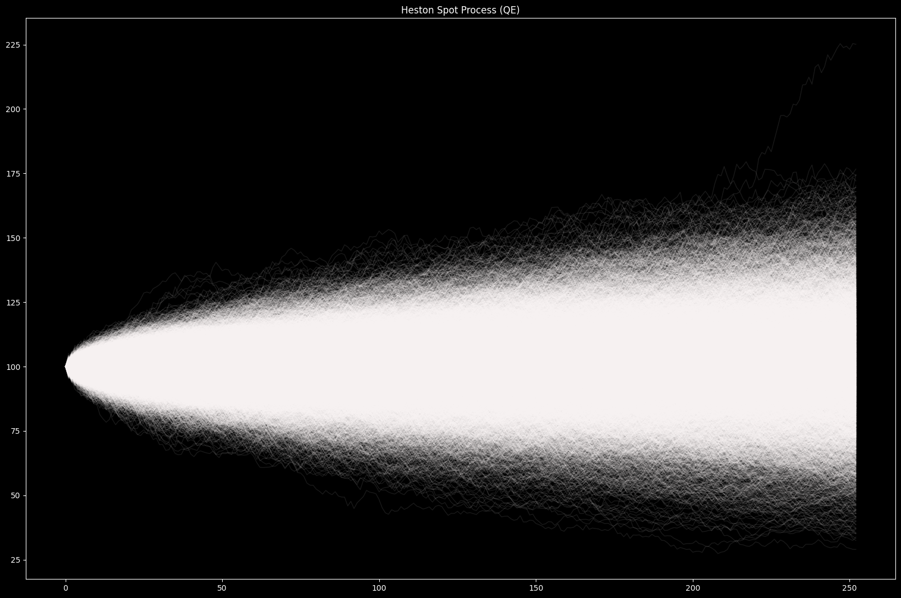
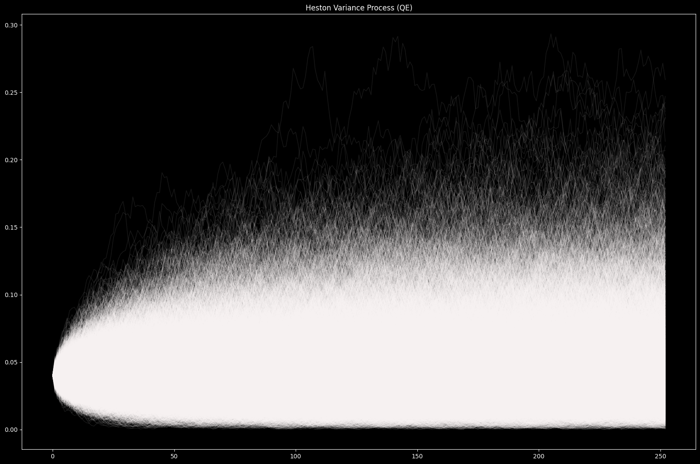
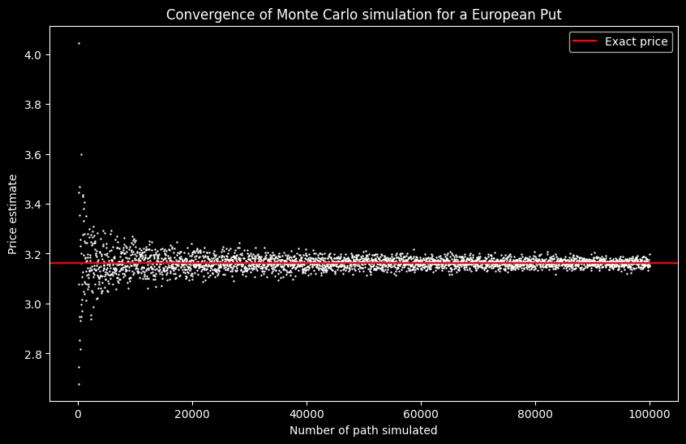

# Monte Carlo 

This project aims at implementing a light Monte Carlo engine for asset pricing models with non-constant volatility. 

## Current features 

The code architecture is organized around three main classes : `Model`, `Scheme`, `Engine`.

**`Model`**

The Model class represents the parameters for the stochastic dynamic.

- Black-Scholes model (`BlackScholes`)
    - `mu` : the drift rate
    - `sigma` : the volatility
- Heston model (`Heston`)
    - `mu` : the drift rate
    - `kappa` : mean-reversion speed
    - `theta` : long-term variance
    - `epsilon` : vol-of-vol
    - `rho` : spot/vol brownian correlation
- Dupire model (`Dupire`)            
    - `r` : the risk-free rate
    - `q` : the dividend yield
    - `local_volatility_surface` : the local volatility surface as a `LocalVolatilitySurface` instance 

**`Schemes`**

Schemes describe how to discretize a model at each time step. 

- Black-Scholes exact log discretization (`EulerBlackScholes`)
- Heston Euler-type discretization with full truncation (`EulerHeston`)
- Dupire discretization (`EulerDupire`)
- Quadratic Exponential (`QE`)

**`Engine`** 

The engine in charge of generating the paths

- `MonteCarlo`
    - `.generate()` : returns a specified number of paths. 
        - `S0` initial spot value
        - `v0` optional initial variance value for Heston model
        - `n` the number of steps in each path
        - `T` the time period of generation
        - `n_paths` the number of paths to generate
    - `.configure()` : use to set the seed of the engine and the `n_jobs` parameter for the number of CPU cores to use (-1 for maximum)

## Basic Demo

A demo notebook is available [here](doc/demo_notebook.ipynb).

```python
from volmc import Heston, QE, MonteCarlo, SimulationResult

heston = Heston(mu=0.02, 
                kappa=2, 
                theta= 0.05, 
                epsilon=0.3, 
                rho = -0.6)

print(f"Feller condition met : {heston.feller_condition()}")

mc = MonteCarlo(QE(heston))
mc.configure(seed=1, n_jobs = -1)

sim = mc.generate(S0 = 100, 
                  v0 = 0.04, 
                  n = 252, 
                  T = 1, 
                  n_paths = 500_000)

S = sim.spot_values()
V = sim.var_values()
m_price = sim.mean_terminal_spot()
```

**Output**





## Basic Pricing Example

```python
final_spots = S[:,-1]
payoffs = np.maximum((final_spots - K), 0)
call_price = np.exp(-r*T) * payoffs.mean()
```

The following graph shows the convergence of the price estimation depending on the number of paths generated. Red line indicates the exact Black Scholes price for this call. 



## Notes and additional documentation 

The core of this module is coded in C++ and accessed through the [Python API](volmc/_api.py). 

### Theoretical background

Some notes on the theoretical background of this project can be found in the [doc folder](doc/background).


### To be added
- Optimizations for faster computation
- More models & schemes
- Variance reduction for MonteCarlo 